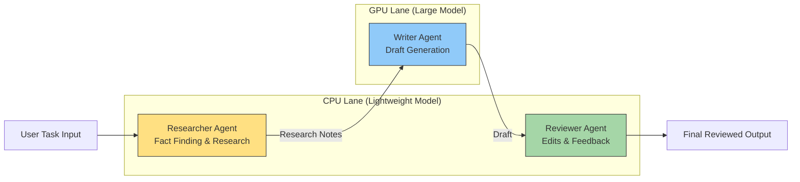

# Multi-Agent App on 2 Endpoints

Routing:
- Researcher -> CPU endpoint (lightweight model)
- Writer -> GPU endpoint (large model)
- Reviewer -> CPU endpoint (lightweight model)

---

## Architecture Overview

The multi-agent pipeline runs **three logical agents** across **two hardware endpoints**.

| Agent | Hardware | Model | UI Color |
|------|------|------|------|
| Researcher | CPU | Lightweight model (e.g. Llama-8B) | Yellow |
| Writer | GPU | Large model (e.g. Qwen-32B / Llama-405B) | Blue |
| Reviewer | CPU | Lightweight model (e.g. Llama-8B) | Green |

Panel headers in the UI automatically reflect the configured model names via `GPU_MODEL` and `CPU_MODEL` environment variables.

The pipeline follows a **dependency order** but allows **partial parallel execution** using a pipelined architecture.

---

# Hardware Mapping Diagram

This diagram matches the **colors used in the UI demo**.



---

# Runtime Execution (Pipelined)

Although the logical dependency is:

```
Researcher -> Writer -> Reviewer
```

the system uses **pipelined execution**, meaning later stages may start before earlier stages fully complete.

```
Time ->
Researcher (CPU)  =============
Writer (GPU)           =================
Reviewer (CPU)                ========
```

This means:

- Researcher begins first
- Writer starts when **partial notes arrive**
- Reviewer starts when **a partial draft exists**

This architecture reduces overall latency compared to strictly sequential execution.

---

# Why This Hardware Split Works

### CPU (lightweight model)

Best for lightweight reasoning tasks:

- research extraction
- summarization
- critique and editing
- short outputs

### GPU (large model)

Best for heavy generation tasks:

- long structured responses
- complex reasoning
- synthesis across notes

### Pipeline Benefit

Without pipelining:

```
Total latency = Research + Write + Review
```

With pipelining:

```
Total latency ~ max(Research, Write, Review)
```

because stages overlap in time.

---

# Files

- `app.py` - colorful UI + SSE stream (panel headers auto-populated from model env vars)
- `agents.py` - 2-endpoint routing logic
- `vllm_client.py` - OpenAI-compatible streaming client
- `env_set.sh` - environment setup helper
- `Run.sh` - one-command launcher
- `requirements.txt`

---

# Quick Start

## 1. Start the vLLM endpoints

The UI requires two vLLM endpoints already running. If using the cpu_binding docker compose setup:

```bash
cd ../  # cpu_binding directory
MODE=deploy MODEL="Qwen/Qwen2.5-32B-Instruct" PORT=8000 \
  CPU_MODEL="meta-llama/Llama-3.1-8B-Instruct" CPU_PORT=8001 \
  HF_TOKEN="<your-token>" \
  EXTRA_ARGS="--swap-space 16 --tensor-parallel-size 1 --disable-log-stats --gpu-memory-utilization 0.85 --max-model-len 2048" \
  CPU_EXTRA_ARGS="--dtype bfloat16 --distributed-executor-backend mp --block-size 128 --trust-remote-code --enable-chunked-prefill --disable-log-stats --enforce-eager --max-num-batched-tokens 2048 --max-num-seqs 256 --tensor-parallel-size 4" \
  docker compose -f docker-compose.yml -f docker-compose.cpu.yml -f docker-compose.override.yml --profile deploy up -d
```

Wait for the GPU healthcheck to pass (~2-5 min for model loading).

## 2. Install UI dependencies

```bash
# Use a virtual environment (required on Ubuntu 24.04+ due to PEP 668)
python3 -m venv ~/venv
source ~/venv/bin/activate
pip install -r requirements.txt
```

## 3. Configure and run

```bash
cd multi_agent_two_endpoints/
source ./env_set.sh

# Override defaults if needed:
export DRY_RUN=0
export CPU_URL=http://localhost:8001
export GPU_URL=http://localhost:8000
export CPU_MODEL=meta-llama/Llama-3.1-8B-Instruct
export GPU_MODEL=Qwen/Qwen2.5-32B-Instruct

# Run on port 8080 (default; override with UI_PORT)
bash Run.sh
```

Open: `http://<vm-ip>:8080`

> **Note:** On Azure, add an NSG rule to allow inbound TCP on port 8080.

---

# Dry-run mode

Test the UI without vLLM backends:

```bash
source ./env_set.sh
export DRY_RUN=1
bash Run.sh
```

---

# Environment Variables

| Variable | Default | Description |
|----------|---------|-------------|
| `DRY_RUN` | `0` | Set to `1` for mock responses without vLLM |
| `CPU_URL` | `http://localhost:8001` | CPU vLLM endpoint base URL |
| `CPU_MODEL` | `meta-llama/Llama-3.1-8B-Instruct` | CPU model name |
| `GPU_URL` | `http://localhost:8000` | GPU vLLM endpoint base URL |
| `GPU_MODEL` | `Qwen/Qwen2.5-32B-Instruct` | GPU model name |
| `UI_PORT` | `8080` | Port for the UI server |
| `RESEARCHER_MAX_TOKENS` | `700` | Max tokens for researcher |
| `WRITER_MAX_TOKENS` | `2500` | Max tokens for writer |
| `REVIEWER_MAX_TOKENS` | `400` | Max tokens for reviewer |
| `WRITER_TIMEOUT_S` | `300` | Writer timeout (increase for first inference on Blackwell) |

---

# Azure Blackwell Notes

- **First inference warmup**: The first request through the GPU Writer agent triggers CUDA kernel compilation on Blackwell GPUs, which takes **30+ minutes**. Set `WRITER_TIMEOUT_S=2400` to avoid timeout. Subsequent requests are fast.
- **Port 8080 only**: Only the UI port needs to be exposed publicly. The vLLM endpoints (8000, 8001) can remain internal to the VM.
- **Virtual environment required**: Ubuntu 24.04 enforces PEP 668 — use a venv for pip installs.

### Single-endpoint fallback

When only one vLLM endpoint is available, point both `CPU_URL` and `GPU_URL` at the same address:

```bash
DRY_RUN=0 \
CPU_URL=http://127.0.0.1:8000 \
GPU_URL=http://127.0.0.1:8000 \
CPU_MODEL=Qwen/Qwen2.5-32B-Instruct \
GPU_MODEL=Qwen/Qwen2.5-32B-Instruct \
uvicorn app:app --host 0.0.0.0 --port 8080
```

### Verify UI

```bash
curl -s http://127.0.0.1:8080/mode
curl -s -X POST http://127.0.0.1:8080/start \
  -H "Content-Type: application/json" \
  -d '{"task":"Say hello"}'
```

- `/mode` returns JSON with `mode: vllm` and the configured URLs.
- `/start` returns a `run_id`; poll with `/poll?run_id=<id>&cursor=0` to get events.

### Disk space

If the root disk fills up, move pip temp/cache to `/mnt`:

```bash
sudo mkdir -p /mnt/venv-ui /mnt/pip-tmp /mnt/pip-cache
sudo chown -R $USER:docker /mnt/venv-ui /mnt/pip-tmp /mnt/pip-cache
python3 -m venv /mnt/venv-ui
source /mnt/venv-ui/bin/activate
TMPDIR=/mnt/pip-tmp PIP_CACHE_DIR=/mnt/pip-cache pip install -r requirements.txt
```
