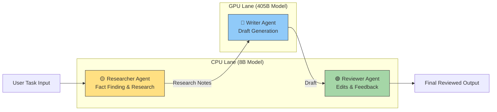
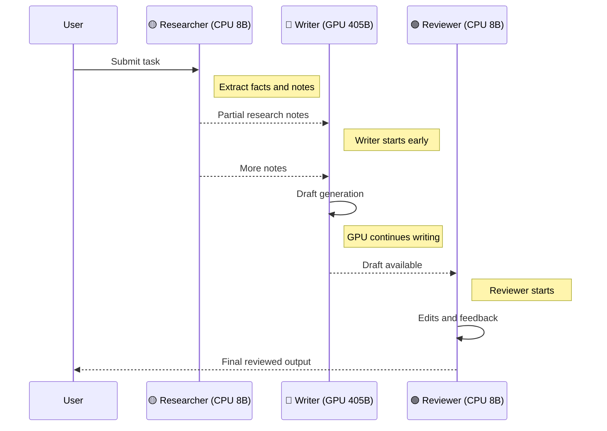

# Multi-Agent App on 2 Endpoints

Routing:
- Researcher -> CPU endpoint (8B)
- Writer -> GPU endpoint (405B)
- Reviewer -> CPU endpoint (8B)

---

## Architecture Overview

The multi-agent pipeline runs **three logical agents** across **two hardware endpoints**.

| Agent | Hardware | Model | UI Color |
|------|------|------|------|
| Researcher | CPU | 8B model | 🟡 Yellow |
| Writer | GPU | 405B model | 🔵 Blue |
| Reviewer | CPU | 8B model | 🟢 Green |

The pipeline follows a **dependency order** but allows **partial parallel execution** using a pipelined architecture.

---

# Hardware Mapping Diagram

This diagram matches the **colors used in the UI demo**.



---

# Runtime Execution (Pipelined)

Although the logical dependency is:

```
Researcher → Writer → Reviewer
```

the system uses **pipelined execution**, meaning later stages may start before earlier stages fully complete.



---

# Runtime Parallelism

During execution, the stages overlap in time.

```
Time →
Researcher (CPU 8B)  █████████████
Writer (GPU 405B)          █████████████████
Reviewer (CPU 8B)                 ███████
```

This means:

- Researcher begins first
- Writer starts when **partial notes arrive**
- Reviewer starts when **a partial draft exists**

This architecture reduces overall latency compared to strictly sequential execution.

---

# Why This Hardware Split Works

### CPU (8B model)

Best for lightweight reasoning tasks:

- research extraction
- summarization
- critique and editing
- short outputs

### GPU (405B model)

Best for heavy generation tasks:

- long structured responses
- complex reasoning
- synthesis across notes

### Pipeline Benefit

Without pipelining:

```
Total latency = Research + Write + Review
```

With pipelining:

```
Total latency ≈ max(Research, Write, Review)
```

because stages overlap in time.

---

# Files

- `app.py` - colorful UI + SSE stream
- `agents.py` - 2-endpoint routing logic
- `vllm_client.py` - OpenAI-compatible streaming client
- `env_set.sh` - environment setup helper
- `requirements.txt`

---

# Dry-run mode

```bash
source ./env_set.sh
export DRY_RUN=1
uvicorn app:app --host 0.0.0.0 --port 8000
```

---

# Real vLLM mode

First start the two model endpoints.

### CPU 8B endpoint

```bash
VLLM_CPU_KVCACHE_SPACE=8 vllm serve meta-llama/Llama-3.1-8B-Instruct   --host 0.0.0.0 --port 8001   --dtype bfloat16   --max-model-len 8192
```

### GPU 405B endpoint

```bash
vllm serve meta-llama/Llama-3.1-405B-Instruct   --host 0.0.0.0 --port 8002   --dtype bfloat16   --max-model-len 8192
```

Then run the UI.

### Option A (intended): 2 endpoints

```bash
source ./env_set.sh
export DRY_RUN=0
export CPU_URL=http://<cpu-host>:8001
export GPU_URL=http://<gpu-host>:8002

pip install -r requirements.txt
uvicorn app:app --host 0.0.0.0 --port 8000
```

### Option B (validated on this VM): single existing endpoint on :8000

Use this when only one vLLM endpoint is available.

```bash
cd ~/vllm/benchmarks/cpu_binding/multi_agent_two_endpoints
source /mnt/venv-ui/bin/activate
DRY_RUN=0 \
CPU_URL=http://127.0.0.1:8000 \
GPU_URL=http://127.0.0.1:8000 \
CPU_MODEL=Qwen/Qwen2.5-32B-Instruct \
GPU_MODEL=Qwen/Qwen2.5-32B-Instruct \
uvicorn app:app --host 0.0.0.0 --port 8080
```

### Verify UI and stream path

```bash
curl -s http://127.0.0.1:8080/mode
curl -N "http://127.0.0.1:8080/stream?task=testing"
```

Expected behavior:

- `/mode` returns JSON with `mode: vllm` and the configured URLs.
- `/stream` prints `event: status` followed by `event: update` chunks.

### Open the UI

```text
http://localhost:8000
# or http://localhost:8080 when using Option B
```

If accessing from outside the VM, use `http://<VM_PUBLIC_IP>:8000` (or `:8080`
for Option B) and allow inbound TCP in NSG/firewall.

### Debugging: Root disk is full

If `pip install -r requirements.txt` fails with `No space left on device`, use a
virtual environment on `/mnt`.

```bash
# one-time setup
sudo mkdir -p /mnt/venv-ui /mnt/pip-tmp /mnt/pip-cache
sudo chown -R $USER:docker /mnt/venv-ui /mnt/pip-tmp /mnt/pip-cache
sudo chmod 775 /mnt/venv-ui /mnt/pip-tmp /mnt/pip-cache

# create and activate venv on /mnt
python3 -m venv /mnt/venv-ui
source /mnt/venv-ui/bin/activate

# keep pip temp/cache off root disk
export TMPDIR=/mnt/pip-tmp
export PIP_CACHE_DIR=/mnt/pip-cache

pip install -r requirements.txt
```

After installing dependencies, run the same launch command from **Real vLLM mode** above.
If port `8000` is already in use, run the UI on `8080` instead.

Open:

```
http://localhost:8000
# or http://localhost:8080 when using the /mnt fallback launch above
```
